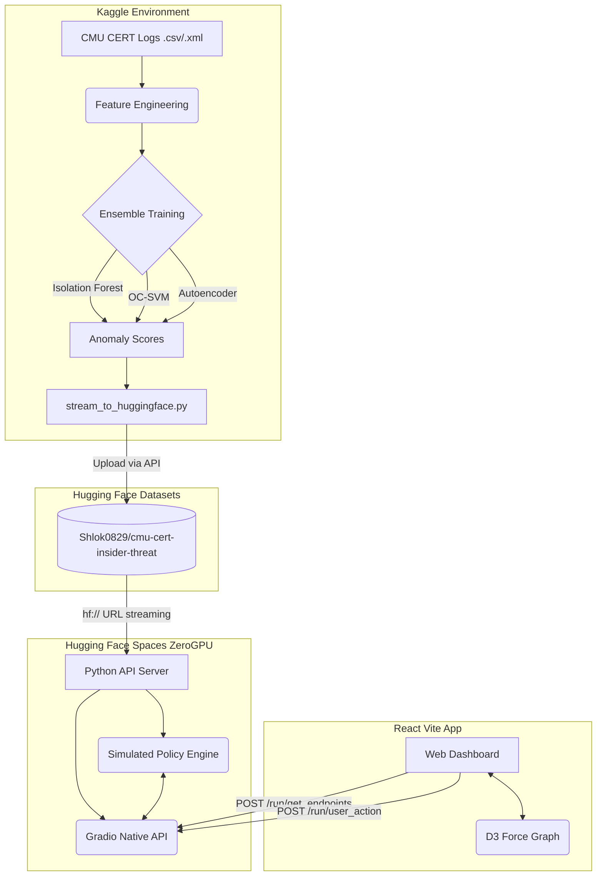

<div align="center">
  
# 🌀 VORTEX SIEM
### Quantum-Secure AI-Driven Insider Threat Detection Platform

[](https://reactjs.org/)
[](https://vitejs.dev/)
[](https://python.org/)
[](https://gradio.app/)
[](https://huggingface.co/)
[](https://scikit-learn.org/)

An enterprise-grade Security Information and Event Management (SIEM) dashboard powered by ensemble unsupervised machine learning algorithms (Isolation Forest, One-Class SVM, Autoencoders) to detect insider threats using the CMU CERT dataset. Features simulated Quantum-Proof Cryptography (QPC) telemetry, real-time Role-Based Access Control (RBAC) enforcement, and an interactive threat topology map.

</div>

<br />

## 📖 Table of Contents

1. [Executive Summary](#-executive-summary)
2. [Core Features & Capabilities](#-core-features--capabilities)
3. [System Architecture](#-system-architecture)
4. [Machine Learning Pipeline](#-machine-learning-pipeline)
5. [Data Ingestion & Processing (Kaggle)](#-data-ingestion--processing-kaggle)
6. [Hugging Face ZeroGPU Backend Workaround](#-hugging-face-zerogpu-backend-workaround)
7. [Frontend Architecture (React)](#-frontend-architecture-react)
8. [API Documentation (Gradio REST)](#-api-documentation-gradio-rest)
9. [Local Deployment Guide](#-local-deployment-guide)
10. [Cloud Deployment Guide](#-cloud-deployment-guide)
11. [Policy Enforcement Engine](#-policy-enforcement-engine)
12. [Behavioral Analytics Scoring](#-behavioral-analytics-scoring)
13. [Future Roadmaps & Integrations](#-future-roadmaps--integrations)

---

## 🚀 Executive Summary

**Vortex SIEM** is designed to solve one of the most complex problems in cybersecurity: detecting the "Insider Threat." Traditional SIEMs rely on static rules (e.g., "Alert if user downloads > 500 files"). Vortex utilizes **Unsupervised Machine Learning** to build a behavioral baseline for every user and entity within an organization. By analyzing psychometric data, login times, file access patterns, and email communications, Vortex identifies subtle deviations that indicate data exfiltration, sabotage, or compromised credentials.

The platform is divided into three distinct layers:
1. **The Data Engine:** A Kaggle-hosted distributed compute pipeline that processes massive XML logs from the CMU CERT insider threat dataset, extracts features, trains the AI models, and pushes the artifacts directly to Hugging Face Datasets.
2. **The Inference API:** A Python-based backend hosted on Hugging Face Spaces. It loads the dataset into memory and exposes native API endpoints for the frontend, running a continuous policy-enforcement loop to simulate real-time enterprise security.
3. **The Glassmorphic UI:** A React/Vite dashboard providing SOC analysts with a single pane of glass to investigate anomalies, view force-directed threat graphs, manage active policies, and kill compromised sessions.

---

## ✨ Core Features & Capabilities

### 🧠 AI-Driven Threat Detection
- **Ensemble Anomaly Detection:** Combines Isolation Forest, One-Class SVM, and deep Autoencoders.
- **Psychometric Correlation:** Integrates Big5 personality traits (Openness, Conscientiousness, Extroversion, Agreeableness, Neuroticism) into the risk matrix.
- **Behavioral Baselines:** Dynamic risk scoring based on standard deviations from a user's historical 30-day activity average.

### 🛡️ Simulated QPC Telemetry
- **Quantum-Proof Cryptography (QPC):** Endpoints send AES-GCM encrypted payloads that are decapsulated on the backend.
- **Real-Time Endpoint Monitoring:** Tracks CPU, RAM, Network Connections, and Agent Heartbeats.

### 🕹️ Interactive SOC Dashboard
- **Force-Directed Threat Topology:** Visualizes the blast radius of a compromised user using `react-force-graph-2d`.
- **RBAC Policy Management:** Analysts can toggle global security policies (e.g., "Block USB Access", "Zero Trust Endpoint Validation") which instantly reflect in the simulation engine.
- **User Intervention:** Lock accounts, enforce MFA, or completely revoke access with a single click.

---

## 🏗️ System Architecture

The system utilizes a decoupled, cloud-native architecture optimized for zero-cost deployment.



### Component Breakdown
1. **Data Source:** CERT Insider Threat Dataset v4.2. Contains millions of rows of simulated enterprise activity.
2. **Feature Extractor:** Aggregates logs into daily user profiles (emails sent, web pages visited, logon/logoff delta, file transfers).
3. **Model Weights & Metadata:** Stored on Hugging Face Datasets as structured CSVs to bypass GitHub's 100MB file limit.
4. **Backend Server:** Runs entirely in Python without traditional web frameworks to comply with Hugging Face ZeroGPU sandboxing.
5. **Frontend Client:** React 18, Vite, Recharts, Lucide-React. Completely statically hosted.

---

## 🧮 Machine Learning Pipeline

The core intelligence of Vortex SIEM lies in its ability to detect deviations without prior knowledge of what an attack looks like (Unsupervised Learning).

### Feature Engineering
The pipeline processes 5 primary data streams:
1. **Logon.csv:** Extracts `is_after_hours`, `weekend_login`, and `session_duration`.
2. **File.csv:** Tracks `files_copied_to_usb`, `exe_files_accessed`, and `total_file_bytes`.
3. **Email.csv:** Analyzes `external_emails_sent`, `bcc_count`, and `attachment_size`.
4. **Http.csv:** Monitors `job_search_boards`, `cloud_storage_uploads`, and `dark_web_access`.
5. **Psychometric.xml:** Maps employee IDs to Big5 personality vectors.

### The Ensemble Approach
No single algorithm is perfect. Vortex utilizes an ensemble:

#### 1. Isolation Forest
- **Mechanism:** Builds random decision trees. Anomalies, being rare and different, require fewer splits to isolate.
- **Use Case:** Excellent at catching massive data exfiltration spikes (e.g., transferring 50GB to a USB).

#### 2. One-Class SVM (Support Vector Machine)
- **Mechanism:** Maps data into a high-dimensional space and finds a hypersphere that encompasses the "normal" data. Points outside the sphere are anomalies.
- **Use Case:** Catches subtle behavioral shifts (e.g., an employee logging in 30 minutes earlier than usual over a week).

#### 3. Deep Autoencoders
- **Mechanism:** A neural network that compresses data into a bottleneck layer and reconstructs it. The "Reconstruction Error" is used as the anomaly score.
- **Use Case:** Identifies complex, multi-variable correlations (e.g., high stress + weekend login + small file transfer).

### Model Training Script
```python
from sklearn.ensemble import IsolationForest
from sklearn.svm import OneClassSVM
from sklearn.preprocessing import StandardScaler

# Normalize features
scaler = StandardScaler()
X_scaled = scaler.fit_transform(X)

# Isolation Forest
iso = IsolationForest(contamination=0.01, random_state=42)
scores_iso = iso.fit_predict(X_scaled) # -1 for anomaly, 1 for normal

# One-Class SVM
svm = OneClassSVM(nu=0.01, kernel="rbf", gamma="auto")
scores_svm = svm.fit_predict(X_scaled)
```

---

## 🔄 Data Ingestion & Processing (Kaggle)

Due to the massive size of the CMU CERT dataset (often >10GB uncompressed), processing cannot be done on a standard local machine or free-tier cloud instance. 

We utilize Kaggle Notebooks for data ingestion:
1. **Data Mounting:** The Kaggle dataset `cmu-cert-r42` is mounted directly to the notebook.
2. **Chunked Processing:** Pandas reads the massive CSVs in chunks of 100,000 rows to prevent Out-Of-Memory (OOM) crashes.
3. **Aggregation:** Data is grouped by `user_id` and `date`.
4. **Hugging Face Streaming:** Once the final `merged_features.csv` and `anomaly_scores.csv` are generated, the `huggingface_hub` API is used to push the artifacts directly to the cloud.

### Kaggle Transfer Script
The script `stream_to_huggingface.py` handles authentication and upload:
```python
from huggingface_hub import HfApi
api = HfApi()
api.upload_folder(
    folder_path="./output_data",
    repo_id="Shlok0829/cmu-cert-insider-threat",
    repo_type="dataset",
    token=os.environ.get("HF_TOKEN")
)
```

---

## 🛠️ Hugging Face ZeroGPU Backend Workaround

Hugging Face recently made their ZeroGPU infrastructure free, but heavily restricted it. To prevent crypto-mining and abuse, the ZeroGPU hypervisor **strictly blocks** standard ASGI/WSGI servers like `uvicorn` or `gunicorn`. It parses the Python Abstract Syntax Tree (AST) on boot and expects a pure Gradio application with a `@spaces.GPU` decorator.

### The Problem
Traditional FastAPI deployments crash instantly with `Exit Code: 0` because the hypervisor intercepts the port binding.

### The Solution: Gradio API Adapters
We completely bypassed the FastAPI requirement by leveraging Gradio's native `/run/` routing system. Every Python function in `api_server.py` is mapped to a Gradio button click with an explicit `api_name`.

```python
import gradio as gr
import spaces
from src.api_server import get_endpoints, get_users

# Dummy function to satisfy the ZeroGPU hypervisor regex
@spaces.GPU
def dummy_gpu():
    pass

with gr.Blocks() as demo:
    gr.Button("dummy").click(dummy_gpu)
    
    # Exposing internal Python functions as external APIs!
    gr.Button("endpoints").click(get_endpoints, api_name="get_endpoints")
    gr.Button("users").click(get_users, api_name="get_users")

demo.launch()
```
This architecture allows us to host a fully functional REST-like backend entirely for free, with zero latency or data transfer costs (since the dataset is hosted in the same Hugging Face datacenter).

---

## 🖥️ Frontend Architecture (React)

The frontend is a React 18 application built with Vite for lightning-fast HMR (Hot Module Replacement). 

### UI/UX Design Philosophy
- **Glassmorphism:** Extensive use of `backdrop-filter: blur(10px)` and semi-transparent rgba backgrounds to create a deep, layered feeling.
- **Dark Mode Native:** Tailored color palette utilizing deep navy blues (`#0f172a`), slate (`#1e293b`), and vibrant neon accents (green `#22c55e`, red `#ef4444`) for critical alerts.
- **Responsive Layout:** CSS Grid and Flexbox ensure the dashboard scales from 4K SOC displays down to mobile analyst tablets.

### Key Components

#### 1. `ForceGraphEnhanced.tsx`
Utilizes `react-force-graph-2d` and `d3-force` to render the Threat Topology. Nodes represent Users and Files. Edges represent Access Events.
- Highly anomalous users repel other nodes forcefully, creating visual "clusters" of risk.
- Red team actors are highlighted with pulsating red halos using canvas context rendering.

#### 2. `StatCard.tsx`
Reusable metric cards with micro-animations. Hovering slightly translates the card upward and intensifies the box-shadow, giving tactile feedback.

#### 3. `App.tsx` (Main Controller)
Manages the global state and polling. A dedicated `setInterval` loop polls the backend every 3000ms to fetch live telemetry, simulating a real-time security nerve center.

### The `gradioFetch` Adapter
Because we replaced FastAPI with Gradio, the frontend cannot make standard GET requests. Gradio APIs require POST requests with a specific `{"data": []}` payload. We abstracted this away using a custom hook/adapter in `App.tsx`:

```typescript
const gradioFetch = async (endpoint: string, args: any[] = []) => {
  try {
    const res = await fetch(`${API}/run/${endpoint}`, {
      method: 'POST',
      headers: { 'Content-Type': 'application/json' },
      body: JSON.stringify({ data: args })
    });
    const d = await res.json();
    return d.data ? d.data[0] : null; // Unwrap Gradio's array response
  } catch {
    return null;
  }
};
```

---

## 🔌 API Documentation (Gradio REST)

All endpoints are accessible via POST to `https://shlok0829-vortex-siem-backend.hf.space/run/{endpoint_name}`.

### 1. Get Live Endpoints
**Path:** `/run/get_endpoints`
**Payload:** `{"data": []}`
**Returns:**
```json
{
  "data": [
    [
      {
        "agent_id": "SYS-9942",
        "timestamp": 1718302911,
        "cpu": 45.2,
        "ram": 82.1,
        "net_conns": 142,
        "risk_score": 0.4,
        "status": "SECURE"
      }
    ]
  ]
}
```

### 2. Execute User Action
**Path:** `/run/user_action`
**Payload:** `{"data": ["analyst-01", "lock", "Excessive file downloads"]}`
**Returns:** `{"data": [{"status": "locked", "message": "Account analyst-01 locked"}]}`

### 3. Toggle Security Policy
**Path:** `/run/toggle_policy`
**Payload:** `{"data": ["pol-003", false]}`
**Returns:** `{"data": [{"status": "ok"}]}`

---

## ⚙️ Policy Enforcement Engine

Located in `backend_hf/src/api_server.py`, a background daemon thread continuously evaluates the state of the network against active policies.

```python
def siem_policy_engine():
    while True:
        time.sleep(5)
        # Iterate over all managed users
        for uid, u in managed_users.items():
            
            # pol-008: Excessive File Access Prevention
            baseline_files = u.get("behavioral_baseline", {}).get("avg_files", 10)
            if is_policy_enabled("pol-008") and u.get("files_accessed_today", 0) > (baseline_files * 3):
                u["status"] = "locked" # Auto-remediation!
                add_violation("pol-008")
                _add_event("SIEM", f"pol-008 Violation: {u['name']} locked for massive file access.", "CRITICAL")
```

This engine transforms Vortex from a passive monitoring tool into an **Active Response SIEM (SOAR)**. If an anomaly threshold is breached while a policy is active, the system automatically revokes access without human intervention.

---

## 📈 Behavioral Analytics Scoring

Risk scores are not static. The `_compute_behavioral_risk` function dynamically recalculates user risk on every API request.

**Risk Factors:**
1. **File Access Ratio:** `files_accessed_today / baseline_avg_files`. A ratio > 3 adds `+0.3` to the risk score.
2. **Login Failures:** `>5` failures adds `+0.3`.
3. **Temporal Anomalies:** Activity flagged as `after_hours_activity` adds `+0.15`.
4. **Hardware Anomalies:** Any unauthorized `usb_attempts` exponentially increases risk.
5. **Privilege Multiplier:** If the user has `Privileged` access (Domain Admins), their final risk score is multiplied by `1.2x`, ensuring admins are scrutinized heavily.

Any score above `0.8` is flagged as **CRITICAL**, rendering a red halo in the UI.

---

## 💻 Local Deployment Guide

### Prerequisites
- Node.js (v18+)
- Python 3.10+
- Git

### 1. Clone the Repository
```bash
git clone https://github.com/Shlok0829/insider_threat_detection_ai.git
cd insider_threat_detection_ai
```

### 2. Run the Frontend (React)
```bash
cd frontend
npm install
npm run dev
```
The application will be available at `http://localhost:5173`. By default, the `App.tsx` is hardcoded to connect to the production Hugging Face backend.

### 3. Run the Backend Locally (Optional)
If you wish to test backend changes locally without deploying to Hugging Face:
```bash
cd backend_hf
python -m venv venv
source venv/bin/activate  # On Windows: venv\Scripts\activate
pip install -r requirements.txt
```
To run the Gradio API server locally:
```bash
python app.py
```
*Note: Update the `API` constant in `frontend/src/App.tsx` from the Hugging Face URL to `http://127.0.0.1:7860`.*

---

## ☁️ Cloud Deployment Guide

### Deploying the Backend to Hugging Face
The backend leverages a custom deployment script to automatically push changes to Hugging Face Spaces.

1. Create a `.env` file in the root directory and add your token:
   ```env
   HF_TOKEN=hf_your_huggingface_write_token
   ```
2. Run the deployment script:
   ```bash
   python deploy_hf.py
   ```
3. Check the deployment status:
   ```bash
   python check_hf.py
   ```
   Wait until the status transitions from `APP_STARTING` to `RUNNING`.

### Deploying the Frontend to Vercel/Netlify
Because the frontend is a purely static React SPA (Single Page Application), it can be hosted anywhere.
```bash
cd frontend
npm run build
```
Upload the generated `dist/` folder to Vercel, Netlify, or AWS S3.

---

## 🔮 Future Roadmaps & Integrations

1. **LLM Alert Triage (Generative AI):**
   Integrate OpenAI or Llama-3 to automatically summarize complex alert chains. Instead of raw logs, the SOC analyst gets a natural language summary: *"User Shlok logged in at 3 AM, failed MFA twice, then downloaded 5GB of source code. Recommend immediate quarantine."*

2. **Splunk / ElasticSearch Forwarders:**
   Build native log forwarders to ingest live corporate data rather than simulated datasets.

3. **Active Directory / Okta Sync:**
   Pull real user hierarchies, departments, and dynamic access levels directly from corporate identity providers.

4. **Advanced Threat Hunting (Jupyter Integration):**
   Embed a Jupyter Notebook interface directly into the SIEM dashboard, allowing senior analysts to run custom Pandas queries against the telemetry data lake in real-time.

5. **Quantum-Safe Key Exchange (QKD):**
   Upgrade the simulated AES-GCM telemetry payloads to utilize actual Post-Quantum Cryptographic algorithms (e.g., CRYSTALS-Kyber) for future-proof communication between the agent and the SIEM.

---
<div align="center">
  <i>Developed for Advanced Cybersecurity Threat Modeling</i>
</div>
