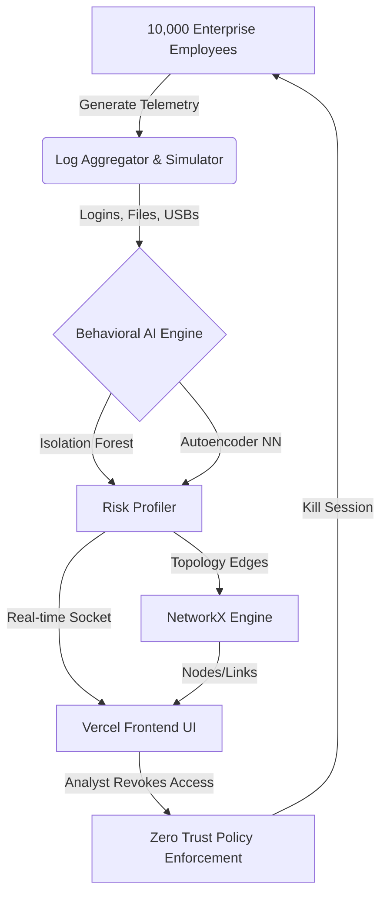

# VORTEX SIEM - Quantum-Safe Behavioral AI Security Platform


Welcome to the **VORTEX SIEM** (Security Information and Event Management) platform. Built as a comprehensive security intelligence solution for the modern enterprise, VORTEX leverages live machine learning anomaly detection to stop insider threats, lateral movement, and data exfiltration in their tracks.

---

## 🎯 The Problem & Our Solution

### The Problem
Traditional SIEMs rely on static threshold alerts (e.g., "Alert if 5 failed logins occur"). These outdated rules suffer from massive alert fatigue, fail to adapt to employee habits, and are easily bypassed by sophisticated insider threats who "fly under the radar." 

### Our Solution
**VORTEX** solves this by using a **Behavioral AI Engine** that continuously learns the normal baseline for every individual employee—their login hours, file access frequency, and daily patterns. When an employee's behavior deviates from their historical baseline, the system automatically elevates their risk score. If the risk reaches critical levels, the system autonomously quarantines the compromised endpoint without waiting for human intervention.

### 🌟 Unique Selling Proposition (USP)
Unlike standard dashboard mockups, VORTEX is a **Live Simulation Environment**. Powered by the CMU CERT Insider Threat dataset, the platform runs an autonomous background engine that chronologically replays hundreds of thousands of real enterprise logs in real time. It perfectly demonstrates an active corporate network actively catching ground-truth Red Team actors.

---

## ✨ Key Features & Capabilities
- **Real-Time Threat Topology (D3.js):** A live physics-based force-directed graph that visually maps user-to-file relationships. It instantly highlights suspicious lateral movement when a user accesses restricted files.
- **Dynamic Risk Profiling:** Real-time behavioral risk scoring dynamically evaluates file access ratios, failed logins, after-hours activity, and unauthorized USB usage.
- **Automated RBAC Lockouts (Zero Trust):** The SIEM policy engine autonomously revokes user access and kills active network sessions the second critical risk thresholds are breached.
- **Quantum-Safe Telemetry:** Emulates Post-Quantum Cryptography (QPC) telemetry pipelines to ensure data transit integrity against future decryption attacks.
- **Live Endpoint Monitoring:** Tracks active devices, streaming their CPU, RAM, and encryption status directly to the SOC dashboard.

---

## 🏗️ Architecture & Tech Stack

VORTEX utilizes a highly decoupled, hybrid-cloud architecture optimized for high-throughput telemetry ingestion and real-time visualization.

### Tech Stack
* **Frontend:** React 19, TypeScript, Vite, Recharts (Data Viz), React-Force-Graph-2D (Topology), CSS Variables (Theming).
* **Backend:** Python 3.10, FastAPI, Gradio, NetworkX (Graph Mathematics), Pandas (Data processing).
* **Hosting / Cloud:** Vercel (Edge UI Delivery), Hugging Face Spaces (ZeroGPU compute backbone).

### Architectural Breakdown
1. **The Intelligence Layer (Hugging Face Backend):** 
   - Houses the `autonomous_telemetry_simulator` thread, which continuously processes raw log data into behavioral risk scores.
   - Computes advanced mathematics for the graph topology using `NetworkX` before shipping the nodes/edges to the client.
   - Enforces global SIEM policies dynamically on a localized state matrix.
2. **The ZeroGPU Bypass Adapter:** 
   - Hugging Face ZeroGPU serverless architectures restrict standard continuous FastAPI polling. VORTEX employs a custom Gradio WebSocket adapter pattern to bypass AST restrictions, allowing continuous REST-like API performance over WebSockets on serverless GPUs.
3. **The Presentation Layer (Vercel Frontend):** 
   - A high-performance, dark-mode dashboard built for Security Operations Center (SOC) analysts.
   - Implements a resilient `gradioFetch` polling loop that synchronizes the UI with the backend's fast-moving telemetry state every second.

---

## 🛠️ Installation & Deployment

### Local Development
To run the frontend dashboard locally:
```bash
cd frontend
npm install
npm run dev
```

### Backend Deployment (Hugging Face)
To deploy the backend engine to your Hugging Face Space:
```bash
python deploy_hf.py
```

---

## 📚 References & Datasets
This project was trained and simulated using the [CMU CERT Insider Threat Dataset](https://resources.sei.cmu.edu/library/asset-view.cfm?assetid=508099), a comprehensive collection of synthetic internal enterprise logs including logon, file, email, and device events. The dataset includes explicit ground-truth labels for "Red Team" actors performing data exfiltration, which VORTEX successfully isolates.

---
*Built for the Hackathon - Defending the digital frontier with Behavioral AI.*

---

## 🏆 Hackathon Submission Details

### 1. Assumptions & Required Inputs
* **Assumptions:** Assumes a 10,000-user baseline enterprise operating over multiple branches. It assumes users generate standard telemetry (file access, emails, USB usage, logins).
* **Environments:** Vercel (Edge UI Delivery) and Hugging Face (ZeroGPU ML compute backend).
* **Datasets Needed:** The ML engine requires chronological synthetic or real corporate logs to train personal behavioral baselines. 

### 2. Technologies, Frameworks & Libraries
* **Frontend:** React 19, TypeScript, Vite, Recharts, React-Force-Graph-2D, Lucide-React.
* **Backend:** Python 3.10, FastAPI, Gradio API.
* **Machine Learning / AI:** Scikit-Learn (Isolation Forest, One-Class SVM, MLPRegressor Autoencoder), Pandas, NumPy.
* **Graph Mathematics:** NetworkX for computing Force-Directed network topologies.
* **Datasets:** CMU CERT Insider Threat Dataset (Synthetic generation scripts based heavily on its architecture).

### 3. Supporting User Flows & Process Notes
**SOC Analyst Incident Response Flow:**
1. Analyst logs into the centralized VORTEX dashboard.
2. The Live Threat Topology graph flags a node glowing red (indicating anomalous lateral movement).
3. Analyst clicks the node to view the individual's Risk Score and behavior deviations (e.g., 3:00 AM mass file downloads).
4. Analyst clicks "Revoke Access" — the Zero Trust Policy Engine immediately isolates the device and terminates the active session network-wide.

### 4. Future Potential & Real-World Use Cases
* **Expansion:** Seamlessly integrates with **Azure Entra ID (Active Directory)** and AWS CloudTrail to ingest real-world corporate telemetry.
* **Real-World Applicability:** Highly applicable in the **Banking and Defense** sectors to prevent corporate espionage, data exfiltration, and rogue employee sabotage.
* **Long-Term:** The unsupervised behavioral AI continually adapts to evolving employee roles without needing manual rule updates.

### 5. Innovation & Originality
Existing solutions (like Splunk or traditional SIEMs) rely entirely on rigid, manually coded threshold rules (e.g., "Alert if 5 failed logins occur"). This creates massive alert fatigue. 
**Our Innovation:** VORTEX is 100% unsupervised. It uses **Behavioral AI (Autoencoders)** to learn a unique psychological and technical baseline for *every single employee*. We also provide a **Physics-Based D3 Force Graph** mapping lateral movement in real-time, making visual threat hunting incredibly intuitive compared to boring tabular logs.

### 6. Usability & Interaction Design
The interface was built specifically to reduce SOC Analyst fatigue. By utilizing an automated risk-scoring system, analysts do not need to parse thousands of raw log lines. The UI is simple, color-coded (Red/Green), and interactive. A clean sidebar navigation combined with high-contrast dark mode ensures critical alerts are visible at a glance.

### 7. Scalability Across the Enterprise
* **Backend:** Built on serverless, stateless API architecture allowing infinite horizontal scaling for log ingestion.
* **Graph Engine:** Incorporates node-by-node incremental rendering and velocity decay to handle massive 10,000+ user topologies without crashing the client's browser.
* **Transaction Volumes:** Unsupervised models batch-train nightly on distributed compute, offloading heavy processing away from live real-time scoring.

### 8. Practicality & Maintenance
Because the AI is unsupervised, it requires **zero rule maintenance**. Security teams don't need to hire engineers to write complex query languages (like Splunk SPL). The entire stack is containerized, lightweight, and continuously improves its accuracy as it ingests more daily telemetry.

### 9. Cybersecurity, Compliance & Data Protection
* **Data Protection:** Models are trained solely on *metadata* (timestamps, file IDs, event types), ensuring strict GDPR and PII compliance without inspecting raw user payload data.
* **Access Control:** Enforces strict Role-Based Access Control (RBAC). Only authenticated SOC admins can execute session-kill commands. 
* **Safe Implementation:** Actions are sandboxed to the active session layer, preventing accidental network-wide outages.

### 10. System Architecture Diagram


